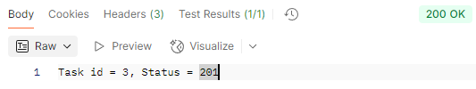

# url-downloader
## Описание проекта
В данном проекте использовались различные стандарты и паттерны проектирования:
- Проект имеет четкое разделение слоев, которое придерживается **project-layout** стандарта;
- Написанный код придерживается принципов **SOLID**. Различные объекты выполняют одну чёткую задачу:
-- **Store** отвечает за хранение и потокобезопасный доступ к задачам;
-- **Service** — за бизнес-логику (скачивание, проверка, архивация);
-- **Handler** — за обработку HTTP-запросов.
Код легко расширяется новыми возможностями без изменения существующей логики: для ограничения количества задач и ссылок, используются константые переменные, которые легко можно изменить в одном месте, также для расширений файлов.
- Для конфигируции сервера используется **YAML**. Параметры сервера задаются в отдельном .yaml-файле;
- Используется паттерн **Repository** для хранения и управления данными. Store инкапсулирует доступ к данным и операции над ними. Остальной код не взаимодействует напрямую с хранилищем задач;
- Применяется **Dependency Injection**. Все зависимости (Store, Service, конфигурация) передаются в конструкторы структур.
- Скачивание файлов для дальнейшей архивации происходит параллельно через goroutines и sync.WaitGroup, доступ к данным синхронизируется с помощью Mutex.

Для запуска сервера необходимо ввести команду из корня репозитория:
`go run .\cmd\app\main.go`

## **API** сервера:

`POST /task` - добавляет новую задачу и возвращает в body ответа **id**

При этом если количество текущих задач равно 3, то вернется ошибка о загрузке серверва 

`GET /task/{id}/status` - возвращает статус задачи по номеру **id**

`POST /task/{id}/load` - добавляет ссылку в хранилище задачи. Когда добавляется 3-я ссылка, то задача отправляется на выполнение. 

В теле ответа возвращается ссылка для загрузки, а также пишется ошибка скачивания файла (не подходящий формат). Вместе с этим меняется статус выполненной задачи и уменьшается внутренний счетчик текущих задач, что позволяет заново создавать задачи.

